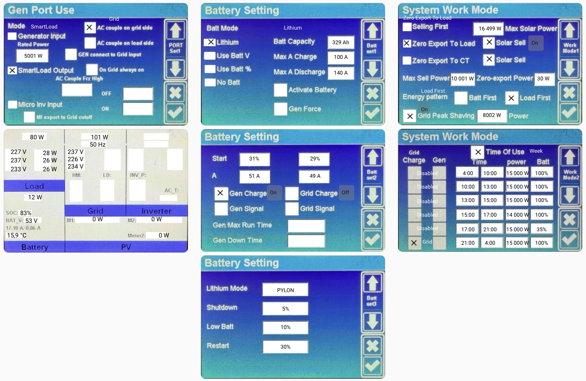

# Zdalne Menu Falownika: DEYE SUN-15k-SG05LP3

Projekt udostępnia wirtualny interfejs graficzny dla Home Assistant, który odwzorowuje fizyczny panel sterowania falownika DEYE. Umożliwia to intuicyjne sterowanie i podgląd parametrów bezpośrednio z poziomu Dashboardu.

---

## ⚙️ Sposób działania
* **Integracja:** Komunikacja odbywa się za pomocą integracji **Solarman**.
* **Interfejs:** Interaktywne encje są nałożone na zdjęcie menu falownika.
* **Podgląd projektu:**

* **Wideo demonstracyjne:** [Zobacz jak to działa (how_it_works.mov)](how_it_works.mov)

## 🛠 Wymagania
* **Home Assistant** (stabilna wersja).
* **Integracja Solarman** (mapowanie encji bazuje na tej integracji).

## 🚀 Instrukcja wdrożenia

### 1. Przygotowanie kodu
Otwórz plik `ha_view_code.txt` i skopiuj jego zawartość.

### 2. Konfiguracja karty w HA
1.  **Dodanie karty:**
    * Obejrzyj film: `krok_1_dodanie_karty.mov`.
    * W Dashboardzie HA dodaj kartę **Manual** i wklej skopiowany kod.

2.  **Dodanie grafik:**
    * Obejrzyj film: `krok_2_dodanie_zdjęć_do_karty.mov`.
    * Wgraj pliki graficzne (tła) do folderu `/www/` w Home Assistant.

---
> [!IMPORTANT]
> Nazwy encji muszą być zgodne z Twoją instalacją Solarman. Jeśli są inne, należy je edytować bezpośrednio w kodzie karty.   
